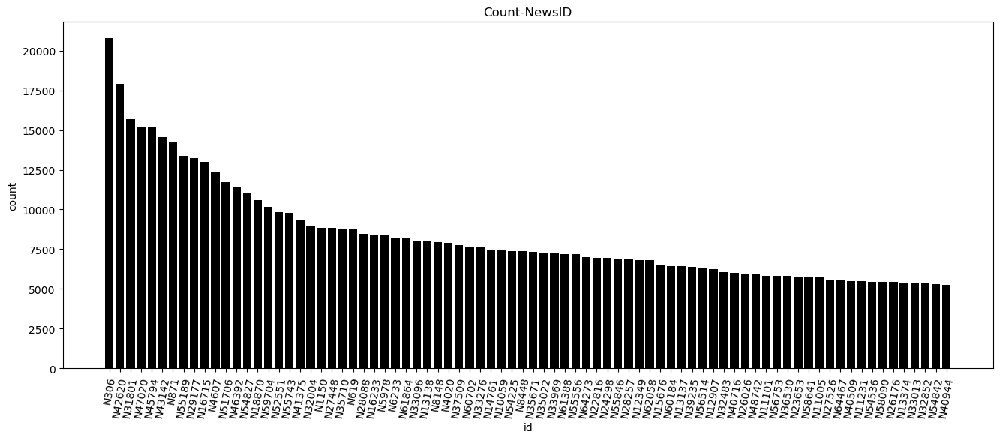
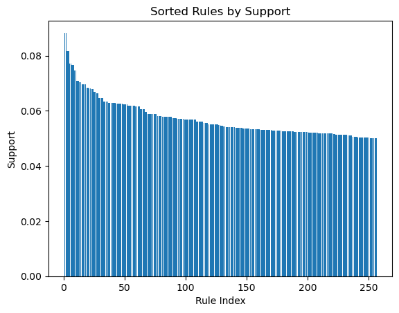
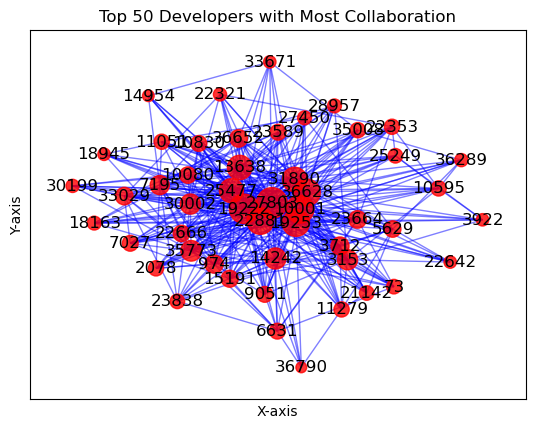
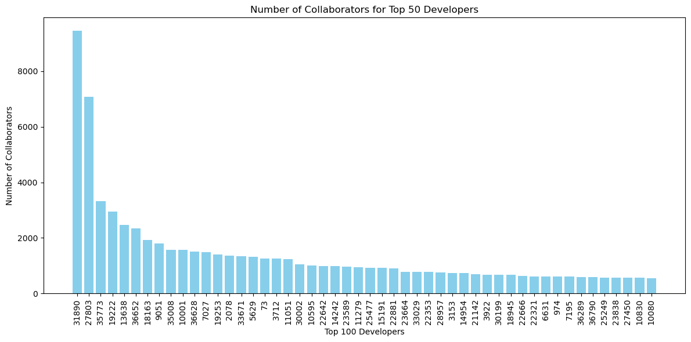

# 北京理工大学-2024研究生课程-数据挖掘-互评作业二: 频繁模式与关联规则挖掘

姓名：周永扬    学号：3220231274
## 1. 问题描述
本次作业中，将选择2个数据集进行分析与挖掘。
## 2. 数据集选择
选择的数据集为：
1. Microsoft 资讯推荐:  https://learn.microsoft.com/zh-cn/azure/open-datasets/dataset-microsoft-news?tabs=azureml-opendatasets
2. SNAP(Stanford Large Network Dataset Collection)中的github social network:https://snap.stanford.edu/data/github-social.html
## 3. 数据分析要求
数据获取与预处理；
频繁模式挖掘：可以是项集、序列和图。
模式命名：如论文-作者网络中合作模式、引用模式和发表模式等，不同的领域的频繁模式的含义也不尽相同，需自行确定模式的名称。
对挖掘结果进行分析；
可视化展示。

## 3.1 Microsoft 资讯推荐
首先依照数据网站给出的说明进行数据下载与读取。


```python
# 数据下载与读取
import os
import tempfile
import shutil
import urllib
import zipfile
import pandas as pd
import numpy as np
from mlxtend.preprocessing import TransactionEncoder
from mlxtend.frequent_patterns import apriori, association_rules

temp_dir = os.path.join(tempfile.gettempdir(), 'mind')
os.makedirs(temp_dir, exist_ok=True)

# The dataset is split into training and validation set, each with a large and small version.
# The format of the four files are the same.
# For demonstration purpose, we will use small version validation set only.
base_url = 'https://mind201910small.blob.core.windows.net/release'
training_small_url = f'{base_url}/MINDsmall_train.zip'
validation_small_url = f'{base_url}/MINDsmall_dev.zip'
training_large_url = f'{base_url}/MINDlarge_train.zip'
validation_large_url = f'{base_url}/MINDlarge_dev.zip'

def download_url(url,
                 destination_filename=None,
                 progress_updater=None,
                 force_download=False,
                 verbose=True):
    """
    Download a URL to a temporary file
    """
    if not verbose:
        progress_updater = None
    # This is not intended to guarantee uniqueness, we just know it happens to guarantee
    # uniqueness for this application.
    if destination_filename is None:
        url_as_filename = url.replace('://', '_').replace('/', '_')
        destination_filename = \
            os.path.join(temp_dir,url_as_filename)
    if (not force_download) and (os.path.isfile(destination_filename)):
        if verbose:
            print('Bypassing download of already-downloaded file {}'.format(
                os.path.basename(url)))
        return destination_filename
    if verbose:
        print('Downloading file {} to {}'.format(os.path.basename(url),
                                                 destination_filename),
              end='')
    urllib.request.urlretrieve(url, destination_filename, progress_updater)
    assert (os.path.isfile(destination_filename))
    nBytes = os.path.getsize(destination_filename)
    if verbose:
        print('...done, {} bytes.'.format(nBytes))
    return destination_filename


zip_path = download_url(training_small_url, destination_filename="../dataset/MINDsmall_train.zip", verbose=True)
with zipfile.ZipFile(zip_path, 'r') as zip_ref:
    zip_ref.extractall(temp_dir)

os.listdir(temp_dir)
```

    Bypassing download of already-downloaded file MINDsmall_train.zip


    ['behaviors.tsv', 'entity_embedding.vec', 'news.tsv', 'relation_embedding.vec']


## 3.1.2 数据预处理
下载数据完成后进行数据预处理。
根据数据集说明，该数据集下总共包含两个表，分别为behaviors.tsv,该表记录了印象日志以及用户的新闻历史点击记录。该表共有印象ID，用户ID，时间，历史记录以及映像五列。需要在read_table时进行指定。


```python
# 读取behaviors.tsv
data_path = os.path.join(temp_dir, 'behaviors.tsv')
column_names = ['ID', 'userID', 'time', 'history', 'behavior']
mind_data = pd.read_table(data_path, names=column_names)

print("columns: {}".format(mind_data.columns))
print("shape: {}".format(mind_data.shape))
mind_data.head()

```

    columns: Index(['ID', 'userID', 'time', 'history', 'behavior'], dtype='object')
    shape: (156965, 5)


<div>
<style scoped>
    .dataframe tbody tr th:only-of-type {
        vertical-align: middle;
    }

    .dataframe tbody tr th {
        vertical-align: top;
    }
    
    .dataframe thead th {
        text-align: right;
    }
</style>
<table border="1" class="dataframe">
  <thead>
    <tr style="text-align: right;">
      <th></th>
      <th>ID</th>
      <th>userID</th>
      <th>time</th>
      <th>history</th>
      <th>behavior</th>
    </tr>
  </thead>
  <tbody>
    <tr>
      <th>0</th>
      <td>1</td>
      <td>U13740</td>
      <td>11/11/2019 9:05:58 AM</td>
      <td>N55189 N42782 N34694 N45794 N18445 N63302 N104...</td>
      <td>N55689-1 N35729-0</td>
    </tr>
    <tr>
      <th>1</th>
      <td>2</td>
      <td>U91836</td>
      <td>11/12/2019 6:11:30 PM</td>
      <td>N31739 N6072 N63045 N23979 N35656 N43353 N8129...</td>
      <td>N20678-0 N39317-0 N58114-0 N20495-0 N42977-0 N...</td>
    </tr>
    <tr>
      <th>2</th>
      <td>3</td>
      <td>U73700</td>
      <td>11/14/2019 7:01:48 AM</td>
      <td>N10732 N25792 N7563 N21087 N41087 N5445 N60384...</td>
      <td>N50014-0 N23877-0 N35389-0 N49712-0 N16844-0 N...</td>
    </tr>
    <tr>
      <th>3</th>
      <td>4</td>
      <td>U34670</td>
      <td>11/11/2019 5:28:05 AM</td>
      <td>N45729 N2203 N871 N53880 N41375 N43142 N33013 ...</td>
      <td>N35729-0 N33632-0 N49685-1 N27581-0</td>
    </tr>
    <tr>
      <th>4</th>
      <td>5</td>
      <td>U8125</td>
      <td>11/12/2019 4:11:21 PM</td>
      <td>N10078 N56514 N14904 N33740</td>
      <td>N39985-0 N36050-0 N16096-0 N8400-1 N22407-0 N6...</td>
    </tr>
  </tbody>
</table>
</div>


下面进行数据预处理，需要进行的工作有3项：
1. 对包含Nan的数据进行丢弃。
2. 对于history列，需要将字符串拆分为列表，这是因为history的每一个条目对应一个新闻。
3. 对于behavior列，同样需要根据规则进行拆分，得到每一个新闻条目是否进行了点击。


```python
# 查看Nan数据
Nan_count = mind_data.isna().any(axis=1).sum()
print("Nan count: {}".format(Nan_count))

mind_data = mind_data.dropna()
mind_data_new = mind_data.copy()

# 对history进行处理
mind_data_new['history'] = mind_data['history'].apply(lambda x: x.split())
# 对behavior进行处理
func = lambda x: (t.split('-') for t in x.split())
mind_data_new['behavior'] = mind_data['behavior'].apply(lambda x: [t.split('-') for t in x.split()])

mind_data_new.head()
```

    Nan count: 3238


<div>
<style scoped>
    .dataframe tbody tr th:only-of-type {
        vertical-align: middle;
    }

    .dataframe tbody tr th {
        vertical-align: top;
    }
    
    .dataframe thead th {
        text-align: right;
    }
</style>
<table border="1" class="dataframe">
  <thead>
    <tr style="text-align: right;">
      <th></th>
      <th>ID</th>
      <th>userID</th>
      <th>time</th>
      <th>history</th>
      <th>behavior</th>
    </tr>
  </thead>
  <tbody>
    <tr>
      <th>0</th>
      <td>1</td>
      <td>U13740</td>
      <td>11/11/2019 9:05:58 AM</td>
      <td>[N55189, N42782, N34694, N45794, N18445, N6330...</td>
      <td>[[N55689, 1], [N35729, 0]]</td>
    </tr>
    <tr>
      <th>1</th>
      <td>2</td>
      <td>U91836</td>
      <td>11/12/2019 6:11:30 PM</td>
      <td>[N31739, N6072, N63045, N23979, N35656, N43353...</td>
      <td>[[N20678, 0], [N39317, 0], [N58114, 0], [N2049...</td>
    </tr>
    <tr>
      <th>2</th>
      <td>3</td>
      <td>U73700</td>
      <td>11/14/2019 7:01:48 AM</td>
      <td>[N10732, N25792, N7563, N21087, N41087, N5445,...</td>
      <td>[[N50014, 0], [N23877, 0], [N35389, 0], [N4971...</td>
    </tr>
    <tr>
      <th>3</th>
      <td>4</td>
      <td>U34670</td>
      <td>11/11/2019 5:28:05 AM</td>
      <td>[N45729, N2203, N871, N53880, N41375, N43142, ...</td>
      <td>[[N35729, 0], [N33632, 0], [N49685, 1], [N2758...</td>
    </tr>
    <tr>
      <th>4</th>
      <td>5</td>
      <td>U8125</td>
      <td>11/12/2019 4:11:21 PM</td>
      <td>[N10078, N56514, N14904, N33740]</td>
      <td>[[N39985, 0], [N36050, 0], [N16096, 0], [N8400...</td>
    </tr>
  </tbody>
</table>
</div>


## 3.1.3 频繁模式挖掘
在完成数据预处理后可以进行频繁模式挖掘。
在这一步，我们首先以history作为事务数据，使用apriori算法寻找频繁项集，阈值分别设置为0.02，0.03，0.04。


```python
# 提取历史记录作为事务数据
transactions = list(mind_data_new['history'])

# 使用 TransactionEncoder 转换数据
te = TransactionEncoder()
te_ary = te.fit(transactions).transform(transactions)
df = pd.DataFrame(te_ary, columns=te.columns_)

# 使用 apriori 算法找到频繁项集，设置最小支持度阈值
frequent_itemsets_002 = apriori(df, min_support=0.02, use_colnames=True)
frequent_itemsets_003 = apriori(df, min_support=0.03, use_colnames=True)
frequent_itemsets_004 = apriori(df, min_support=0.04, use_colnames=True)
```


```python
# 查看频繁项集
print("threhold == 0.02 : {}".format(frequent_itemsets_002))
print("threhold == 0.03 : {}".format(frequent_itemsets_003))
print("threhold == 0.04 : {}".format(frequent_itemsets_004))

```

    threhold == 0.02 :       support          itemsets
    0    0.046934          (N10059)
    1    0.020094          (N10235)
    2    0.022039          (N10470)
    3    0.020517          (N10559)
    4    0.027685          (N10865)
    ..        ...               ...
    213  0.023438    (N45794, N306)
    214  0.021187    (N306, N55189)
    215  0.027445      (N306, N871)
    216  0.020023  (N45794, N31801)
    217  0.021284  (N45794, N59704)
    
    [218 rows x 2 columns]
    threhold == 0.03 :      support  itemsets
    0   0.046934  (N10059)
    1   0.031478  (N10897)
    2   0.036448  (N11005)
    3   0.037866  (N11101)
    4   0.035192  (N11231)
    ..       ...       ...
    92  0.035635  (N64467)
    93  0.049224   (N8148)
    94  0.044631   (N8448)
    95  0.087174    (N871)
    96  0.030242   (N9803)
    
    [97 rows x 2 columns]
    threhold == 0.04 :      support  itemsets
    0   0.046934  (N10059)
    1   0.056561   (N1150)
    2   0.043616  (N12349)
    3   0.040188  (N12907)
    4   0.040904  (N13137)
    5   0.051052  (N13138)
    6   0.048339  (N14761)
    7   0.042400  (N15676)
    8   0.053641  (N16233)
    9   0.079544  (N16715)
    10  0.064985  (N18870)
    11  0.045093  (N22816)
    12  0.043005  (N24298)
    13  0.055716  (N27448)
    14  0.054584  (N28088)
    15  0.043623  (N28257)
    16  0.084774  (N29177)
    17  0.132273    (N306)
    18  0.098974  (N31801)
    19  0.057635  (N32004)
    20  0.051767  (N33096)
    21  0.049393  (N33276)
    22  0.046075  (N33969)
    23  0.046387  (N35022)
    24  0.045880  (N35671)
    25  0.056301  (N35710)
    26  0.049809  (N37509)
    27  0.040832  (N39235)
    28  0.050473   (N4020)
    29  0.059827  (N41375)
    30  0.114124  (N42620)
    31  0.093263  (N43142)
    32  0.097712  (N45794)
    33  0.078743   (N4607)
    34  0.072277  (N46392)
    35  0.044273  (N47020)
    36  0.075192  (N51706)
    37  0.063209  (N52551)
    38  0.045607  (N54225)
    39  0.070677  (N54827)
    40  0.084370  (N55189)
    41  0.046036  (N55556)
    42  0.062442  (N55743)
    43  0.044560  (N55846)
    44  0.040617  (N56514)
    45  0.065538  (N59704)
    46  0.053712   (N5978)
    47  0.040806  (N60184)
    48  0.049516  (N60702)
    49  0.045997  (N61388)
    50  0.056470    (N619)
    51  0.043532  (N62058)
    52  0.052242   (N6233)
    53  0.044293  (N64273)
    54  0.049224   (N8148)
    55  0.044631   (N8448)
    56  0.087174    (N871)


在设定阈值分别为0.02，0.03，0.04下，得到的频繁项集分别有218条，97条以及57条。其中以0.02为阈值的情况下，包含2次项集，其余均为1次项集。
下面提取behavior的频繁项集，我们分别统计被点击和未被点击的部分。


```python
# 统计被点击和未被点击的behavior
click_behavior = [
    [item[0] for item in behavior if item[1] == '1']
    for behavior in mind_data_new['behavior']
]
unclick_behavior = [
    [item[0] for item in behavior if item[1] == '0']
    for behavior in mind_data_new['behavior']
]

```

下面将分别进行频繁项集计算。由于点击项比较分散，采用0.005作为阈值，为点击项比较集中，采用0.1作为阈值。


```python
# click的频繁项集
transactions_click = click_behavior
te = TransactionEncoder()
te_ary = te.fit(transactions_click).transform(transactions_click)
df = pd.DataFrame(te_ary, columns=te.columns_)

# # 使用 apriori 算法找到频繁项集，设置最小支持度阈值

click_items = apriori(df, min_support=0.005, use_colnames=True)

```


```python
click_items
```


<div>
<style scoped>
    .dataframe tbody tr th:only-of-type {
        vertical-align: middle;
    }

    .dataframe tbody tr th {
        vertical-align: top;
    }
    
    .dataframe thead th {
        text-align: right;
    }
</style>
<table border="1" class="dataframe">
  <thead>
    <tr style="text-align: right;">
      <th></th>
      <th>support</th>
      <th>itemsets</th>
    </tr>
  </thead>
  <tbody>
    <tr>
      <th>0</th>
      <td>0.005510</td>
      <td>(N1034)</td>
    </tr>
    <tr>
      <th>1</th>
      <td>0.005191</td>
      <td>(N14029)</td>
    </tr>
    <tr>
      <th>2</th>
      <td>0.005601</td>
      <td>(N19661)</td>
    </tr>
    <tr>
      <th>3</th>
      <td>0.005581</td>
      <td>(N23414)</td>
    </tr>
    <tr>
      <th>4</th>
      <td>0.012282</td>
      <td>(N23446)</td>
    </tr>
    <tr>
      <th>5</th>
      <td>0.007195</td>
      <td>(N26262)</td>
    </tr>
    <tr>
      <th>6</th>
      <td>0.013491</td>
      <td>(N287)</td>
    </tr>
    <tr>
      <th>7</th>
      <td>0.020693</td>
      <td>(N33619)</td>
    </tr>
    <tr>
      <th>8</th>
      <td>0.006668</td>
      <td>(N33885)</td>
    </tr>
    <tr>
      <th>9</th>
      <td>0.005367</td>
      <td>(N34185)</td>
    </tr>
    <tr>
      <th>10</th>
      <td>0.021395</td>
      <td>(N35729)</td>
    </tr>
    <tr>
      <th>11</th>
      <td>0.009497</td>
      <td>(N38779)</td>
    </tr>
    <tr>
      <th>12</th>
      <td>0.008209</td>
      <td>(N40839)</td>
    </tr>
    <tr>
      <th>13</th>
      <td>0.007299</td>
      <td>(N41020)</td>
    </tr>
    <tr>
      <th>14</th>
      <td>0.009517</td>
      <td>(N41881)</td>
    </tr>
    <tr>
      <th>15</th>
      <td>0.008983</td>
      <td>(N42977)</td>
    </tr>
    <tr>
      <th>16</th>
      <td>0.006460</td>
      <td>(N45523)</td>
    </tr>
    <tr>
      <th>17</th>
      <td>0.007487</td>
      <td>(N4642)</td>
    </tr>
    <tr>
      <th>18</th>
      <td>0.006980</td>
      <td>(N47020)</td>
    </tr>
    <tr>
      <th>19</th>
      <td>0.005198</td>
      <td>(N47061)</td>
    </tr>
    <tr>
      <th>20</th>
      <td>0.006993</td>
      <td>(N49180)</td>
    </tr>
    <tr>
      <th>21</th>
      <td>0.014532</td>
      <td>(N49279)</td>
    </tr>
    <tr>
      <th>22</th>
      <td>0.014630</td>
      <td>(N49685)</td>
    </tr>
    <tr>
      <th>23</th>
      <td>0.005185</td>
      <td>(N50675)</td>
    </tr>
    <tr>
      <th>24</th>
      <td>0.011917</td>
      <td>(N51048)</td>
    </tr>
    <tr>
      <th>25</th>
      <td>0.007090</td>
      <td>(N52122)</td>
    </tr>
    <tr>
      <th>26</th>
      <td>0.018097</td>
      <td>(N53585)</td>
    </tr>
    <tr>
      <th>27</th>
      <td>0.007012</td>
      <td>(N54489)</td>
    </tr>
    <tr>
      <th>28</th>
      <td>0.027640</td>
      <td>(N55689)</td>
    </tr>
    <tr>
      <th>29</th>
      <td>0.007435</td>
      <td>(N56214)</td>
    </tr>
    <tr>
      <th>30</th>
      <td>0.010115</td>
      <td>(N58363)</td>
    </tr>
    <tr>
      <th>31</th>
      <td>0.007019</td>
      <td>(N59673)</td>
    </tr>
    <tr>
      <th>32</th>
      <td>0.005633</td>
      <td>(N61022)</td>
    </tr>
    <tr>
      <th>33</th>
      <td>0.005198</td>
      <td>(N61233)</td>
    </tr>
    <tr>
      <th>34</th>
      <td>0.010037</td>
      <td>(N62360)</td>
    </tr>
    <tr>
      <th>35</th>
      <td>0.016386</td>
      <td>(N63970)</td>
    </tr>
    <tr>
      <th>36</th>
      <td>0.007253</td>
      <td>(N7821)</td>
    </tr>
  </tbody>
</table>
</div>


```python
# unclick的频繁项集
transactions_click = unclick_behavior
te = TransactionEncoder()
te_ary = te.fit(transactions_click).transform(transactions_click)
df = pd.DataFrame(te_ary, columns=te.columns_)

# # 使用 apriori 算法找到频繁项集，设置最小支持度阈值

unclick_items = apriori(df, min_support=0.05, use_colnames=True)
```


```python
unclick_items
```


<div>
<style scoped>
    .dataframe tbody tr th:only-of-type {
        vertical-align: middle;
    }

    .dataframe tbody tr th {
        vertical-align: top;
    }
    
    .dataframe thead th {
        text-align: right;
    }
</style>
<table border="1" class="dataframe">
  <thead>
    <tr style="text-align: right;">
      <th></th>
      <th>support</th>
      <th>itemsets</th>
    </tr>
  </thead>
  <tbody>
    <tr>
      <th>0</th>
      <td>0.072538</td>
      <td>(N10960)</td>
    </tr>
    <tr>
      <th>1</th>
      <td>0.079817</td>
      <td>(N11817)</td>
    </tr>
    <tr>
      <th>2</th>
      <td>0.068114</td>
      <td>(N11830)</td>
    </tr>
    <tr>
      <th>3</th>
      <td>0.099508</td>
      <td>(N13907)</td>
    </tr>
    <tr>
      <th>4</th>
      <td>0.057706</td>
      <td>(N14029)</td>
    </tr>
    <tr>
      <th>...</th>
      <td>...</td>
      <td>...</td>
    </tr>
    <tr>
      <th>198</th>
      <td>0.053354</td>
      <td>(N62360, N32544, N41020)</td>
    </tr>
    <tr>
      <th>199</th>
      <td>0.053094</td>
      <td>(N62360, N32544, N49180)</td>
    </tr>
    <tr>
      <th>200</th>
      <td>0.056952</td>
      <td>(N59673, N34876, N47061)</td>
    </tr>
    <tr>
      <th>201</th>
      <td>0.057140</td>
      <td>(N36226, N50872, N38779)</td>
    </tr>
    <tr>
      <th>202</th>
      <td>0.058773</td>
      <td>(N62360, N49180, N41020)</td>
    </tr>
  </tbody>
</table>
<p>203 rows × 2 columns</p>
</div>


## 3.1.3 关联规则
下面从未点击的频繁项集计算关联规则


```python
from mlxtend.frequent_patterns import association_rules
rules = association_rules(unclick_items, metric="confidence", min_threshold=0.3)
print("\nAssociation Rules:")
rules
```


    Association Rules:


<div>
<style scoped>
    .dataframe tbody tr th:only-of-type {
        vertical-align: middle;
    }

    .dataframe tbody tr th {
        vertical-align: top;
    }
    
    .dataframe thead th {
        text-align: right;
    }
</style>
<table border="1" class="dataframe">
  <thead>
    <tr style="text-align: right;">
      <th></th>
      <th>antecedents</th>
      <th>consequents</th>
      <th>antecedent support</th>
      <th>consequent support</th>
      <th>support</th>
      <th>confidence</th>
      <th>lift</th>
      <th>leverage</th>
      <th>conviction</th>
      <th>zhangs_metric</th>
    </tr>
  </thead>
  <tbody>
    <tr>
      <th>0</th>
      <td>(N23446)</td>
      <td>(N10960)</td>
      <td>0.086010</td>
      <td>0.072538</td>
      <td>0.052860</td>
      <td>0.614582</td>
      <td>8.472586</td>
      <td>0.046621</td>
      <td>2.406379</td>
      <td>0.964969</td>
    </tr>
    <tr>
      <th>1</th>
      <td>(N10960)</td>
      <td>(N23446)</td>
      <td>0.072538</td>
      <td>0.086010</td>
      <td>0.052860</td>
      <td>0.728724</td>
      <td>8.472586</td>
      <td>0.046621</td>
      <td>3.369225</td>
      <td>0.950952</td>
    </tr>
    <tr>
      <th>2</th>
      <td>(N36226)</td>
      <td>(N10960)</td>
      <td>0.077267</td>
      <td>0.072538</td>
      <td>0.056106</td>
      <td>0.726132</td>
      <td>10.010416</td>
      <td>0.050501</td>
      <td>3.386535</td>
      <td>0.975476</td>
    </tr>
    <tr>
      <th>3</th>
      <td>(N10960)</td>
      <td>(N36226)</td>
      <td>0.072538</td>
      <td>0.077267</td>
      <td>0.056106</td>
      <td>0.773473</td>
      <td>10.010416</td>
      <td>0.050501</td>
      <td>4.073396</td>
      <td>0.970502</td>
    </tr>
    <tr>
      <th>4</th>
      <td>(N38779)</td>
      <td>(N10960)</td>
      <td>0.105297</td>
      <td>0.072538</td>
      <td>0.052704</td>
      <td>0.500525</td>
      <td>6.900208</td>
      <td>0.045066</td>
      <td>1.856875</td>
      <td>0.955710</td>
    </tr>
    <tr>
      <th>...</th>
      <td>...</td>
      <td>...</td>
      <td>...</td>
      <td>...</td>
      <td>...</td>
      <td>...</td>
      <td>...</td>
      <td>...</td>
      <td>...</td>
      <td>...</td>
    </tr>
    <tr>
      <th>251</th>
      <td>(N62360, N41020)</td>
      <td>(N49180)</td>
      <td>0.066930</td>
      <td>0.094726</td>
      <td>0.058773</td>
      <td>0.878122</td>
      <td>9.270094</td>
      <td>0.052433</td>
      <td>7.427720</td>
      <td>0.956120</td>
    </tr>
    <tr>
      <th>252</th>
      <td>(N49180, N41020)</td>
      <td>(N62360)</td>
      <td>0.077078</td>
      <td>0.097010</td>
      <td>0.058773</td>
      <td>0.762512</td>
      <td>7.860164</td>
      <td>0.051296</td>
      <td>3.802250</td>
      <td>0.945666</td>
    </tr>
    <tr>
      <th>253</th>
      <td>(N62360)</td>
      <td>(N49180, N41020)</td>
      <td>0.097010</td>
      <td>0.077078</td>
      <td>0.058773</td>
      <td>0.605847</td>
      <td>7.860164</td>
      <td>0.051296</td>
      <td>2.341533</td>
      <td>0.966540</td>
    </tr>
    <tr>
      <th>254</th>
      <td>(N49180)</td>
      <td>(N62360, N41020)</td>
      <td>0.094726</td>
      <td>0.066930</td>
      <td>0.058773</td>
      <td>0.620450</td>
      <td>9.270094</td>
      <td>0.052433</td>
      <td>2.458361</td>
      <td>0.985477</td>
    </tr>
    <tr>
      <th>255</th>
      <td>(N41020)</td>
      <td>(N62360, N49180)</td>
      <td>0.091571</td>
      <td>0.070326</td>
      <td>0.058773</td>
      <td>0.641827</td>
      <td>9.126460</td>
      <td>0.052333</td>
      <td>2.595601</td>
      <td>0.980185</td>
    </tr>
  </tbody>
</table>
<p>256 rows × 10 columns</p>
</div>


下面对关联规则进行评价。


```python
# 计算提升度
rules['lift'] = rules['lift'].apply(lambda x: round(x, 2))

# 进行卡方检验
observed = rules['support'] * len(df)  # 观察到的频数
expected = rules['antecedent support'] * rules['consequent support'] * len(df)  # 期望频数
chi_squared = ((observed - expected) ** 2 / expected).sum()  # 计算卡方值

# 输出结果
print("关联规则提升度:")
print(rules[['antecedents', 'consequents', 'lift']])
print("\n卡方检验结果:")
print("卡方值:", chi_squared)
```

    关联规则提升度:
              antecedents       consequents   lift
    0            (N23446)          (N10960)   8.47
    1            (N10960)          (N23446)   8.47
    2            (N36226)          (N10960)  10.01
    3            (N10960)          (N36226)  10.01
    4            (N38779)          (N10960)   6.90
    ..                ...               ...    ...
    251  (N62360, N41020)          (N49180)   9.27
    252  (N49180, N41020)          (N62360)   7.86
    253          (N62360)  (N49180, N41020)   7.86
    254          (N49180)  (N62360, N41020)   9.27
    255          (N41020)  (N62360, N49180)   9.13
    
    [256 rows x 3 columns]
    
    卡方检验结果:
    卡方值: 14751176.80647311


下面找出一部分强关联规则,将提升度大于11.0，置信度大于0.9的规则认为是强关联规则。


```python
# strong_rules = rules[(rules['lift'] > 9.0 and rules['confidence'] > 0.7)]
indices =  (rules['lift'] > 11) & (rules['confidence'] > 0.9)
strong_rules = rules[indices]
strong_rules
```


<div>
<style scoped>
    .dataframe tbody tr th:only-of-type {
        vertical-align: middle;
    }

    .dataframe tbody tr th {
        vertical-align: top;
    }
    
    .dataframe thead th {
        text-align: right;
    }
</style>
<table border="1" class="dataframe">
  <thead>
    <tr style="text-align: right;">
      <th></th>
      <th>antecedents</th>
      <th>consequents</th>
      <th>antecedent support</th>
      <th>consequent support</th>
      <th>support</th>
      <th>confidence</th>
      <th>lift</th>
      <th>leverage</th>
      <th>conviction</th>
      <th>zhangs_metric</th>
    </tr>
  </thead>
  <tbody>
    <tr>
      <th>26</th>
      <td>(N154)</td>
      <td>(N42961)</td>
      <td>0.055286</td>
      <td>0.073370</td>
      <td>0.051266</td>
      <td>0.927286</td>
      <td>12.64</td>
      <td>0.047210</td>
      <td>12.743407</td>
      <td>0.974768</td>
    </tr>
    <tr>
      <th>30</th>
      <td>(N62386)</td>
      <td>(N16096)</td>
      <td>0.067965</td>
      <td>0.076259</td>
      <td>0.062292</td>
      <td>0.916539</td>
      <td>12.02</td>
      <td>0.057109</td>
      <td>11.067948</td>
      <td>0.983651</td>
    </tr>
    <tr>
      <th>173</th>
      <td>(N59673, N13907)</td>
      <td>(N34876)</td>
      <td>0.058890</td>
      <td>0.074496</td>
      <td>0.053810</td>
      <td>0.913730</td>
      <td>12.27</td>
      <td>0.049423</td>
      <td>10.728029</td>
      <td>0.975944</td>
    </tr>
    <tr>
      <th>196</th>
      <td>(N62386, N3344)</td>
      <td>(N16096)</td>
      <td>0.055046</td>
      <td>0.076259</td>
      <td>0.051845</td>
      <td>0.941858</td>
      <td>12.35</td>
      <td>0.047647</td>
      <td>15.887602</td>
      <td>0.972570</td>
    </tr>
    <tr>
      <th>198</th>
      <td>(N3344, N16096)</td>
      <td>(N62386)</td>
      <td>0.055111</td>
      <td>0.067965</td>
      <td>0.051845</td>
      <td>0.940746</td>
      <td>13.84</td>
      <td>0.048100</td>
      <td>15.729489</td>
      <td>0.981866</td>
    </tr>
  </tbody>
</table>
</div>


## 3.1.4 模式命名以及分析
下面进行模式命名。
1. 对于(N154)->(N42961)以及(N62386)->(N16096)，命名为无效推荐模式。这类新闻存在的共性使得新闻不容易被推荐以及用户点击。可以挖掘这类新闻在排版、内容、标题、题材上的共性。
2. 对于后三个规则，命名为未点击模式。这类新闻完全不会被点击，说明在具体的内容设置上存在问题，可以改进。

对于推荐新闻而言，应该寻找在不容易被点击新闻中的共性，排除这些导致点击量较低的原因，再在具体的领域进行修改、调整。这类完全不被点击的新闻可能存在严重的基本错误，即从标题、领域开始就难以吸引读者的注意力。

## 3.1.5 可视化
下面进行数据的可视化。
首先通过柱状图展示常见的新闻页面以及对应的频次。
其次通过柱状图可视化关联规则的support值。


```python
from collections import Counter
import matplotlib.pyplot as plt
all_news = [news_id for sublist in mind_data_new['history'] for news_id in sublist]
news_frequency = Counter(all_news)
# 将频率数据转换为DataFrame进行排序和可视化
news_freq_df = pd.DataFrame(news_frequency.items(), columns=['id', 'count'])
news_freq_df = news_freq_df.sort_values(by='count', ascending=False)


# 可视化最常被点击的新闻ID
plt.figure(figsize=(16, 6))
plt.bar(news_freq_df['id'].head(80), news_freq_df['count'].head(80), color='black')
plt.xlabel('id')
plt.ylabel('count')
plt.title('Count-NewsID')
plt.xticks(rotation=80)
plt.show()
```


​    

​    


```python

# 按support大小对strong_rules进行排序
sorted_rules = rules.sort_values(by='support', ascending=False)

# 打印排序后的结果
# print(sorted_rules)
supports = sorted_rules['support']
indices = list(range(1, len(supports) + 1))

# 绘制柱状图
plt.bar(indices, supports)

# 设置坐标轴标签和图表标题
plt.xlabel('Rule Index')
plt.ylabel('Support')
plt.title('Sorted Rules by Support')

# 显示图表
plt.show()
```


​    

​    


## 3.2 SNAP:Github Social Network
第二个数据集采用SNAP的Github Social Network数据集。该数据集包含musae_git_edges.csv数据，该数据为一个无向图数据,包含所有的边，id_1, id_2代表两个id所代表的github用户存在共同合作。下面首先导入数据并创建无向图
### 3.2.1 数据读取与预处理


```python
import pandas as pd
import networkx as nx
from mlxtend.preprocessing import TransactionEncoder
from mlxtend.frequent_patterns import apriori, association_rules
import matplotlib.pyplot as plt

# 读取图数据
df = pd.read_csv("../dataset/git_web_ml/musae_git_edges.csv")

# 创建无向图
G = nx.Graph()

# 添加边到无向图中
for index, row in df.iterrows():
    node1 = row['id_1']
    node2 = row['id_2']
    G.add_edge(node1, node2)
```

下面查看生成的无向图的基本数据，包括节点数目，边数目，平均度数，最大度，最小度。


```python
# 查看节点数和边数
num_nodes = G.number_of_nodes()
num_edges = G.number_of_edges()

print(f"节点数: {num_nodes}")
print(f"边数: {num_edges}")

# 查看最大度和最小度
node_degrees = dict(G.degree(G.nodes()))
max_degree = max(node_degrees.values())
min_degree = min(node_degrees.values())

print(f"最大度: {max_degree}")
print(f"最小度: {min_degree}")

```

    节点数: 37700
    边数: 289003
    最大度: 9458
    最小度: 1


### 3.2.2 频繁模式挖掘
下一步进行频繁模式挖掘。首先提取每个节点相连的节点，并进行列表化。


```python
# 对每个ID记录它哪些被跟随的ID
coopers = {}
for node in G.nodes():
    coopers[node] = list(G.neighbors(node))

coopers[1]
```


    [34526, 2370, 14683, 29982, 21142, 20363, 23830, 34035]


之后对这一列表进行频繁模式挖掘，采用apriori算法，最小支持度设置为0.01


```python
# 将数据转换为适合频繁模式挖掘的格式
te = TransactionEncoder()
data = [coopers[node] for node in coopers]
te_ary = te.fit_transform(data)
transactions = pd.DataFrame(te_ary, columns=te.columns_)
# 应用Apriori算法进行频繁模式挖掘
frequent_itemsets = apriori(transactions, min_support=0.01, use_colnames=True)
frequent_itemsets

```


<div>
<style scoped>
    .dataframe tbody tr th:only-of-type {
        vertical-align: middle;
    }

    .dataframe tbody tr th {
        vertical-align: top;
    }
    
    .dataframe thead th {
        text-align: right;
    }
</style>
<table border="1" class="dataframe">
  <thead>
    <tr style="text-align: right;">
      <th></th>
      <th>support</th>
      <th>itemsets</th>
    </tr>
  </thead>
  <tbody>
    <tr>
      <th>0</th>
      <td>0.033607</td>
      <td>(73)</td>
    </tr>
    <tr>
      <th>1</th>
      <td>0.016101</td>
      <td>(974)</td>
    </tr>
    <tr>
      <th>2</th>
      <td>0.010027</td>
      <td>(1164)</td>
    </tr>
    <tr>
      <th>3</th>
      <td>0.036286</td>
      <td>(2078)</td>
    </tr>
    <tr>
      <th>4</th>
      <td>0.012971</td>
      <td>(2281)</td>
    </tr>
    <tr>
      <th>...</th>
      <td>...</td>
      <td>...</td>
    </tr>
    <tr>
      <th>171</th>
      <td>0.012095</td>
      <td>(31890, 35773, 19222)</td>
    </tr>
    <tr>
      <th>172</th>
      <td>0.010955</td>
      <td>(27803, 36652, 19253)</td>
    </tr>
    <tr>
      <th>173</th>
      <td>0.018170</td>
      <td>(31890, 27803, 35773)</td>
    </tr>
    <tr>
      <th>174</th>
      <td>0.014138</td>
      <td>(31890, 27803, 36652)</td>
    </tr>
    <tr>
      <th>175</th>
      <td>0.013156</td>
      <td>(35008, 31890, 35773)</td>
    </tr>
  </tbody>
</table>
<p>176 rows × 2 columns</p>
</div>


### 3.2.3 关联规则生成以及模式命名分析
下一步根据频繁模式生成关联规则。


```python

# 生成关联规则
rules = association_rules(frequent_itemsets, metric="confidence", min_threshold=0.5)
rules
```


<div>
<style scoped>
    .dataframe tbody tr th:only-of-type {
        vertical-align: middle;
    }

    .dataframe tbody tr th {
        vertical-align: top;
    }
    
    .dataframe thead th {
        text-align: right;
    }
</style>
<table border="1" class="dataframe">
  <thead>
    <tr style="text-align: right;">
      <th></th>
      <th>antecedents</th>
      <th>consequents</th>
      <th>antecedent support</th>
      <th>consequent support</th>
      <th>support</th>
      <th>confidence</th>
      <th>lift</th>
      <th>leverage</th>
      <th>conviction</th>
      <th>zhangs_metric</th>
    </tr>
  </thead>
  <tbody>
    <tr>
      <th>0</th>
      <td>(2078)</td>
      <td>(31890)</td>
      <td>0.036286</td>
      <td>0.250875</td>
      <td>0.020186</td>
      <td>0.556287</td>
      <td>2.217382</td>
      <td>0.011082</td>
      <td>1.688307</td>
      <td>0.569690</td>
    </tr>
    <tr>
      <th>1</th>
      <td>(3153)</td>
      <td>(31890)</td>
      <td>0.019576</td>
      <td>0.250875</td>
      <td>0.012440</td>
      <td>0.635501</td>
      <td>2.533136</td>
      <td>0.007529</td>
      <td>2.055219</td>
      <td>0.617317</td>
    </tr>
    <tr>
      <th>2</th>
      <td>(3712)</td>
      <td>(31890)</td>
      <td>0.033528</td>
      <td>0.250875</td>
      <td>0.022095</td>
      <td>0.659019</td>
      <td>2.626878</td>
      <td>0.013684</td>
      <td>2.196969</td>
      <td>0.640805</td>
    </tr>
    <tr>
      <th>3</th>
      <td>(3922)</td>
      <td>(31890)</td>
      <td>0.018143</td>
      <td>0.250875</td>
      <td>0.010053</td>
      <td>0.554094</td>
      <td>2.208641</td>
      <td>0.005501</td>
      <td>1.680004</td>
      <td>0.557345</td>
    </tr>
    <tr>
      <th>4</th>
      <td>(7027)</td>
      <td>(31890)</td>
      <td>0.039390</td>
      <td>0.250875</td>
      <td>0.023554</td>
      <td>0.597980</td>
      <td>2.383574</td>
      <td>0.013672</td>
      <td>1.863401</td>
      <td>0.604264</td>
    </tr>
    <tr>
      <th>5</th>
      <td>(7027)</td>
      <td>(35773)</td>
      <td>0.039390</td>
      <td>0.088170</td>
      <td>0.020398</td>
      <td>0.517845</td>
      <td>5.873273</td>
      <td>0.016925</td>
      <td>1.891156</td>
      <td>0.863761</td>
    </tr>
    <tr>
      <th>6</th>
      <td>(10080)</td>
      <td>(27803)</td>
      <td>0.014801</td>
      <td>0.187931</td>
      <td>0.010849</td>
      <td>0.732975</td>
      <td>3.900233</td>
      <td>0.008067</td>
      <td>3.041171</td>
      <td>0.754777</td>
    </tr>
    <tr>
      <th>7</th>
      <td>(10080)</td>
      <td>(36652)</td>
      <td>0.014801</td>
      <td>0.062149</td>
      <td>0.012069</td>
      <td>0.815412</td>
      <td>13.120375</td>
      <td>0.011149</td>
      <td>5.080788</td>
      <td>0.937661</td>
    </tr>
    <tr>
      <th>8</th>
      <td>(10595)</td>
      <td>(31890)</td>
      <td>0.026950</td>
      <td>0.250875</td>
      <td>0.020955</td>
      <td>0.777559</td>
      <td>3.099384</td>
      <td>0.014194</td>
      <td>3.367746</td>
      <td>0.696115</td>
    </tr>
    <tr>
      <th>9</th>
      <td>(36289)</td>
      <td>(10595)</td>
      <td>0.015623</td>
      <td>0.026950</td>
      <td>0.010743</td>
      <td>0.687606</td>
      <td>25.514518</td>
      <td>0.010322</td>
      <td>3.114819</td>
      <td>0.976056</td>
    </tr>
    <tr>
      <th>10</th>
      <td>(10830)</td>
      <td>(31890)</td>
      <td>0.015146</td>
      <td>0.250875</td>
      <td>0.010027</td>
      <td>0.661996</td>
      <td>2.638747</td>
      <td>0.006227</td>
      <td>2.216322</td>
      <td>0.630583</td>
    </tr>
    <tr>
      <th>11</th>
      <td>(11279)</td>
      <td>(31890)</td>
      <td>0.024987</td>
      <td>0.250875</td>
      <td>0.017851</td>
      <td>0.714437</td>
      <td>2.847778</td>
      <td>0.011583</td>
      <td>2.623329</td>
      <td>0.665477</td>
    </tr>
    <tr>
      <th>12</th>
      <td>(19253)</td>
      <td>(27803)</td>
      <td>0.037241</td>
      <td>0.187931</td>
      <td>0.020928</td>
      <td>0.561966</td>
      <td>2.990277</td>
      <td>0.013930</td>
      <td>1.853894</td>
      <td>0.691329</td>
    </tr>
    <tr>
      <th>13</th>
      <td>(21142)</td>
      <td>(31890)</td>
      <td>0.018276</td>
      <td>0.250875</td>
      <td>0.013607</td>
      <td>0.744557</td>
      <td>2.967838</td>
      <td>0.009022</td>
      <td>2.932653</td>
      <td>0.675398</td>
    </tr>
    <tr>
      <th>14</th>
      <td>(22353)</td>
      <td>(31890)</td>
      <td>0.020398</td>
      <td>0.250875</td>
      <td>0.011645</td>
      <td>0.570871</td>
      <td>2.275518</td>
      <td>0.006527</td>
      <td>1.745687</td>
      <td>0.572211</td>
    </tr>
    <tr>
      <th>15</th>
      <td>(22642)</td>
      <td>(31890)</td>
      <td>0.026233</td>
      <td>0.250875</td>
      <td>0.016790</td>
      <td>0.640040</td>
      <td>2.551229</td>
      <td>0.010209</td>
      <td>2.081136</td>
      <td>0.624413</td>
    </tr>
    <tr>
      <th>16</th>
      <td>(22666)</td>
      <td>(31890)</td>
      <td>0.016844</td>
      <td>0.250875</td>
      <td>0.010796</td>
      <td>0.640945</td>
      <td>2.554834</td>
      <td>0.006570</td>
      <td>2.086378</td>
      <td>0.619011</td>
    </tr>
    <tr>
      <th>17</th>
      <td>(22881)</td>
      <td>(27803)</td>
      <td>0.024005</td>
      <td>0.187931</td>
      <td>0.012414</td>
      <td>0.517127</td>
      <td>2.751685</td>
      <td>0.007902</td>
      <td>1.681745</td>
      <td>0.652244</td>
    </tr>
    <tr>
      <th>18</th>
      <td>(23589)</td>
      <td>(31890)</td>
      <td>0.025650</td>
      <td>0.250875</td>
      <td>0.015491</td>
      <td>0.603930</td>
      <td>2.407290</td>
      <td>0.009056</td>
      <td>1.891393</td>
      <td>0.599985</td>
    </tr>
    <tr>
      <th>19</th>
      <td>(25477)</td>
      <td>(27803)</td>
      <td>0.024748</td>
      <td>0.187931</td>
      <td>0.013103</td>
      <td>0.529475</td>
      <td>2.817389</td>
      <td>0.008453</td>
      <td>1.725878</td>
      <td>0.661431</td>
    </tr>
    <tr>
      <th>20</th>
      <td>(30002)</td>
      <td>(27803)</td>
      <td>0.027984</td>
      <td>0.187931</td>
      <td>0.014801</td>
      <td>0.528910</td>
      <td>2.814383</td>
      <td>0.009542</td>
      <td>1.723808</td>
      <td>0.663243</td>
    </tr>
    <tr>
      <th>21</th>
      <td>(29982)</td>
      <td>(31890)</td>
      <td>0.012971</td>
      <td>0.250875</td>
      <td>0.010239</td>
      <td>0.789366</td>
      <td>3.146447</td>
      <td>0.006985</td>
      <td>3.556524</td>
      <td>0.691146</td>
    </tr>
    <tr>
      <th>22</th>
      <td>(30002)</td>
      <td>(31890)</td>
      <td>0.027984</td>
      <td>0.250875</td>
      <td>0.016472</td>
      <td>0.588626</td>
      <td>2.346287</td>
      <td>0.009452</td>
      <td>1.821029</td>
      <td>0.590314</td>
    </tr>
    <tr>
      <th>23</th>
      <td>(30199)</td>
      <td>(31890)</td>
      <td>0.017692</td>
      <td>0.250875</td>
      <td>0.010663</td>
      <td>0.602699</td>
      <td>2.402383</td>
      <td>0.006225</td>
      <td>1.885533</td>
      <td>0.594260</td>
    </tr>
    <tr>
      <th>24</th>
      <td>(33029)</td>
      <td>(31890)</td>
      <td>0.020690</td>
      <td>0.250875</td>
      <td>0.011300</td>
      <td>0.546154</td>
      <td>2.176993</td>
      <td>0.006109</td>
      <td>1.650614</td>
      <td>0.552073</td>
    </tr>
    <tr>
      <th>25</th>
      <td>(35008)</td>
      <td>(31890)</td>
      <td>0.041671</td>
      <td>0.250875</td>
      <td>0.022520</td>
      <td>0.540420</td>
      <td>2.154138</td>
      <td>0.012066</td>
      <td>1.630021</td>
      <td>0.559074</td>
    </tr>
    <tr>
      <th>26</th>
      <td>(35773)</td>
      <td>(31890)</td>
      <td>0.088170</td>
      <td>0.250875</td>
      <td>0.046366</td>
      <td>0.525872</td>
      <td>2.096150</td>
      <td>0.024246</td>
      <td>1.580007</td>
      <td>0.573500</td>
    </tr>
    <tr>
      <th>27</th>
      <td>(36289)</td>
      <td>(31890)</td>
      <td>0.015623</td>
      <td>0.250875</td>
      <td>0.011751</td>
      <td>0.752122</td>
      <td>2.997992</td>
      <td>0.007831</td>
      <td>3.022154</td>
      <td>0.677021</td>
    </tr>
    <tr>
      <th>28</th>
      <td>(31890, 2078)</td>
      <td>(35773)</td>
      <td>0.020186</td>
      <td>0.088170</td>
      <td>0.010637</td>
      <td>0.526938</td>
      <td>5.976405</td>
      <td>0.008857</td>
      <td>1.927508</td>
      <td>0.849830</td>
    </tr>
    <tr>
      <th>29</th>
      <td>(35773, 2078)</td>
      <td>(31890)</td>
      <td>0.013077</td>
      <td>0.250875</td>
      <td>0.010637</td>
      <td>0.813387</td>
      <td>3.242198</td>
      <td>0.007356</td>
      <td>4.014331</td>
      <td>0.700731</td>
    </tr>
    <tr>
      <th>30</th>
      <td>(3712, 31890)</td>
      <td>(27803)</td>
      <td>0.022095</td>
      <td>0.187931</td>
      <td>0.011114</td>
      <td>0.503001</td>
      <td>2.676520</td>
      <td>0.006962</td>
      <td>1.633946</td>
      <td>0.640533</td>
    </tr>
    <tr>
      <th>31</th>
      <td>(3712, 27803)</td>
      <td>(31890)</td>
      <td>0.014775</td>
      <td>0.250875</td>
      <td>0.011114</td>
      <td>0.752244</td>
      <td>2.998478</td>
      <td>0.007407</td>
      <td>3.023641</td>
      <td>0.676492</td>
    </tr>
    <tr>
      <th>32</th>
      <td>(3712, 31890)</td>
      <td>(35773)</td>
      <td>0.022095</td>
      <td>0.088170</td>
      <td>0.011645</td>
      <td>0.527011</td>
      <td>5.977228</td>
      <td>0.009696</td>
      <td>1.927804</td>
      <td>0.851513</td>
    </tr>
    <tr>
      <th>33</th>
      <td>(3712, 35773)</td>
      <td>(31890)</td>
      <td>0.015119</td>
      <td>0.250875</td>
      <td>0.011645</td>
      <td>0.770175</td>
      <td>3.069953</td>
      <td>0.007851</td>
      <td>3.259550</td>
      <td>0.684613</td>
    </tr>
    <tr>
      <th>34</th>
      <td>(31890, 7027)</td>
      <td>(35773)</td>
      <td>0.023554</td>
      <td>0.088170</td>
      <td>0.014642</td>
      <td>0.621622</td>
      <td>7.050281</td>
      <td>0.012565</td>
      <td>2.409837</td>
      <td>0.878863</td>
    </tr>
    <tr>
      <th>35</th>
      <td>(7027, 35773)</td>
      <td>(31890)</td>
      <td>0.020398</td>
      <td>0.250875</td>
      <td>0.014642</td>
      <td>0.717815</td>
      <td>2.861243</td>
      <td>0.009525</td>
      <td>2.654732</td>
      <td>0.664047</td>
    </tr>
    <tr>
      <th>36</th>
      <td>(31890, 9051)</td>
      <td>(35773)</td>
      <td>0.021061</td>
      <td>0.088170</td>
      <td>0.011432</td>
      <td>0.542821</td>
      <td>6.156546</td>
      <td>0.009575</td>
      <td>1.994472</td>
      <td>0.855591</td>
    </tr>
    <tr>
      <th>37</th>
      <td>(9051, 35773)</td>
      <td>(31890)</td>
      <td>0.019204</td>
      <td>0.250875</td>
      <td>0.011432</td>
      <td>0.595304</td>
      <td>2.372907</td>
      <td>0.006614</td>
      <td>1.851079</td>
      <td>0.589905</td>
    </tr>
    <tr>
      <th>38</th>
      <td>(27803, 13638)</td>
      <td>(31890)</td>
      <td>0.026207</td>
      <td>0.250875</td>
      <td>0.013660</td>
      <td>0.521255</td>
      <td>2.077745</td>
      <td>0.007086</td>
      <td>1.564768</td>
      <td>0.532669</td>
    </tr>
    <tr>
      <th>39</th>
      <td>(35773, 13638)</td>
      <td>(31890)</td>
      <td>0.015040</td>
      <td>0.250875</td>
      <td>0.010318</td>
      <td>0.686067</td>
      <td>2.734693</td>
      <td>0.006545</td>
      <td>2.386257</td>
      <td>0.644014</td>
    </tr>
    <tr>
      <th>40</th>
      <td>(31890, 19222)</td>
      <td>(27803)</td>
      <td>0.029867</td>
      <td>0.187931</td>
      <td>0.015968</td>
      <td>0.534636</td>
      <td>2.844851</td>
      <td>0.010355</td>
      <td>1.745018</td>
      <td>0.668453</td>
    </tr>
    <tr>
      <th>41</th>
      <td>(35773, 19222)</td>
      <td>(27803)</td>
      <td>0.020000</td>
      <td>0.187931</td>
      <td>0.010106</td>
      <td>0.505305</td>
      <td>2.688779</td>
      <td>0.006347</td>
      <td>1.641555</td>
      <td>0.640902</td>
    </tr>
    <tr>
      <th>42</th>
      <td>(35773, 19222)</td>
      <td>(31890)</td>
      <td>0.020000</td>
      <td>0.250875</td>
      <td>0.012095</td>
      <td>0.604775</td>
      <td>2.410658</td>
      <td>0.007078</td>
      <td>1.895436</td>
      <td>0.597118</td>
    </tr>
    <tr>
      <th>43</th>
      <td>(27803, 19253)</td>
      <td>(36652)</td>
      <td>0.020928</td>
      <td>0.062149</td>
      <td>0.010955</td>
      <td>0.523447</td>
      <td>8.422521</td>
      <td>0.009654</td>
      <td>1.967991</td>
      <td>0.900109</td>
    </tr>
    <tr>
      <th>44</th>
      <td>(36652, 19253)</td>
      <td>(27803)</td>
      <td>0.013979</td>
      <td>0.187931</td>
      <td>0.010955</td>
      <td>0.783681</td>
      <td>4.170047</td>
      <td>0.008328</td>
      <td>3.754038</td>
      <td>0.770972</td>
    </tr>
    <tr>
      <th>45</th>
      <td>(27803, 35773)</td>
      <td>(31890)</td>
      <td>0.027480</td>
      <td>0.250875</td>
      <td>0.018170</td>
      <td>0.661197</td>
      <td>2.635560</td>
      <td>0.011276</td>
      <td>2.211092</td>
      <td>0.638109</td>
    </tr>
    <tr>
      <th>46</th>
      <td>(31890, 36652)</td>
      <td>(27803)</td>
      <td>0.026446</td>
      <td>0.187931</td>
      <td>0.014138</td>
      <td>0.534604</td>
      <td>2.844681</td>
      <td>0.009168</td>
      <td>1.744898</td>
      <td>0.666082</td>
    </tr>
    <tr>
      <th>47</th>
      <td>(35008, 31890)</td>
      <td>(35773)</td>
      <td>0.022520</td>
      <td>0.088170</td>
      <td>0.013156</td>
      <td>0.584217</td>
      <td>6.626044</td>
      <td>0.011171</td>
      <td>2.193042</td>
      <td>0.868642</td>
    </tr>
    <tr>
      <th>48</th>
      <td>(35008, 35773)</td>
      <td>(31890)</td>
      <td>0.018170</td>
      <td>0.250875</td>
      <td>0.013156</td>
      <td>0.724088</td>
      <td>2.886245</td>
      <td>0.008598</td>
      <td>2.715081</td>
      <td>0.665623</td>
    </tr>
  </tbody>
</table>
</div>


之后对规则进行命名，由于我们挖掘了每个用户合作的其他用户的频繁模式。对于以上规则，可以产生以下模式：
1. 合作模式
    对于两个满足频繁模式的用户，可以认为他们常常在一个项目中合作。
2. 中心开发者模式
    对于那些与多个开发者相关的用户，可以认为它们是中心开发者，例如37、38、39、42、45、48都出现的31890号开发者总是与不同的开发者共同出现，可以认为它参与到了多个项目中，与很多人都有合作。
3. 领导模式
    对于那些常常伴随某个开发者出现的用户，可以认为满足领导模式，即某个或某些开发者，常常领导其他开发者参与到项目中。

对于以上挖掘结果来看，重要的开发者是指那些参与到大量项目中，与其他开发者具有较多合作的用户。同时重要开发者的合作者，也很可能是重要的开发者。
下面对关联规则进行评价。


```python
# 计算提升度
rules['lift'] = rules['lift'].apply(lambda x: round(x, 2))

# 进行卡方检验
observed = rules['support'] * len(df)  # 观察到的频数
expected = rules['antecedent support'] * rules['consequent support'] * len(df)  # 期望频数
chi_squared = ((observed - expected) ** 2 / expected).sum()  # 计算卡方值

# 输出结果
print("关联规则提升度:")
print(rules[['antecedents', 'consequents', 'lift']])
print("\n卡方检验结果:")
print("卡方值:", chi_squared)
```

    关联规则提升度:
           antecedents consequents   lift
    0           (2078)     (31890)   2.22
    1           (3153)     (31890)   2.53
    2           (3712)     (31890)   2.63
    3           (3922)     (31890)   2.21
    4           (7027)     (31890)   2.38
    5           (7027)     (35773)   5.87
    6          (10080)     (27803)   3.90
    7          (10080)     (36652)  13.12
    8          (10595)     (31890)   3.10
    9          (36289)     (10595)  25.51
    10         (10830)     (31890)   2.64
    11         (11279)     (31890)   2.85
    12         (19253)     (27803)   2.99
    13         (21142)     (31890)   2.97
    14         (22353)     (31890)   2.28
    15         (22642)     (31890)   2.55
    16         (22666)     (31890)   2.55
    17         (22881)     (27803)   2.75
    18         (23589)     (31890)   2.41
    19         (25477)     (27803)   2.82
    20         (30002)     (27803)   2.81
    21         (29982)     (31890)   3.15
    22         (30002)     (31890)   2.35
    23         (30199)     (31890)   2.40
    24         (33029)     (31890)   2.18
    25         (35008)     (31890)   2.15
    26         (35773)     (31890)   2.10
    27         (36289)     (31890)   3.00
    28   (31890, 2078)     (35773)   5.98
    29   (35773, 2078)     (31890)   3.24
    30   (3712, 31890)     (27803)   2.68
    31   (3712, 27803)     (31890)   3.00
    32   (3712, 31890)     (35773)   5.98
    33   (3712, 35773)     (31890)   3.07
    34   (31890, 7027)     (35773)   7.05
    35   (7027, 35773)     (31890)   2.86
    36   (31890, 9051)     (35773)   6.16
    37   (9051, 35773)     (31890)   2.37
    38  (27803, 13638)     (31890)   2.08
    39  (35773, 13638)     (31890)   2.73
    40  (31890, 19222)     (27803)   2.84
    41  (35773, 19222)     (27803)   2.69
    42  (35773, 19222)     (31890)   2.41
    43  (27803, 19253)     (36652)   8.42
    44  (36652, 19253)     (27803)   4.17
    45  (27803, 35773)     (31890)   2.64
    46  (31890, 36652)     (27803)   2.84
    47  (35008, 31890)     (35773)   6.63
    48  (35008, 35773)     (31890)   2.89
    
    卡方检验结果:
    卡方值: 416815.1998608441


```python
# 找出强关联规则
indices =  (rules['lift'] > 7) & (rules['confidence'] > 0.5)
strong_rules = rules[indices]
strong_rules
```


<div>
<style scoped>
    .dataframe tbody tr th:only-of-type {
        vertical-align: middle;
    }

    .dataframe tbody tr th {
        vertical-align: top;
    }
    
    .dataframe thead th {
        text-align: right;
    }
</style>
<table border="1" class="dataframe">
  <thead>
    <tr style="text-align: right;">
      <th></th>
      <th>antecedents</th>
      <th>consequents</th>
      <th>antecedent support</th>
      <th>consequent support</th>
      <th>support</th>
      <th>confidence</th>
      <th>lift</th>
      <th>leverage</th>
      <th>conviction</th>
      <th>zhangs_metric</th>
    </tr>
  </thead>
  <tbody>
    <tr>
      <th>7</th>
      <td>(10080)</td>
      <td>(36652)</td>
      <td>0.014801</td>
      <td>0.062149</td>
      <td>0.012069</td>
      <td>0.815412</td>
      <td>13.12</td>
      <td>0.011149</td>
      <td>5.080788</td>
      <td>0.937661</td>
    </tr>
    <tr>
      <th>9</th>
      <td>(36289)</td>
      <td>(10595)</td>
      <td>0.015623</td>
      <td>0.026950</td>
      <td>0.010743</td>
      <td>0.687606</td>
      <td>25.51</td>
      <td>0.010322</td>
      <td>3.114819</td>
      <td>0.976056</td>
    </tr>
    <tr>
      <th>34</th>
      <td>(31890, 7027)</td>
      <td>(35773)</td>
      <td>0.023554</td>
      <td>0.088170</td>
      <td>0.014642</td>
      <td>0.621622</td>
      <td>7.05</td>
      <td>0.012565</td>
      <td>2.409837</td>
      <td>0.878863</td>
    </tr>
    <tr>
      <th>43</th>
      <td>(27803, 19253)</td>
      <td>(36652)</td>
      <td>0.020928</td>
      <td>0.062149</td>
      <td>0.010955</td>
      <td>0.523447</td>
      <td>8.42</td>
      <td>0.009654</td>
      <td>1.967991</td>
      <td>0.900109</td>
    </tr>
  </tbody>
</table>
</div>


### 3.2.5 可视化与分析
首先可视化与他人合作最多的100位开发者。


```python
# 计算每个节点的度
node_degrees = dict(G.degree(G.nodes()))
# 找到与他人合作最多的50位开发者
top_50_developers = sorted(node_degrees, key=node_degrees.get, reverse=True)[:50]

# 创建子图
subgraph = G.subgraph(top_50_developers)

# 计算子图中节点的度
subgraph_node_degrees = dict(subgraph.degree(subgraph.nodes()))
# 绘制子图
pos = nx.spring_layout(subgraph)
nx.draw_networkx_nodes(subgraph, pos, node_size=[v * 10 for v in subgraph_node_degrees.values()], node_color='r', alpha=0.8)
nx.draw_networkx_edges(subgraph, pos, edge_color='b', alpha=0.5)
nx.draw_networkx_labels(subgraph, pos, font_size=12)

# 添加标题和坐标轴标签
plt.title("Top 50 Developers with Most Collaboration")
plt.xlabel("X-axis")
plt.ylabel("Y-axis")

# 显示图形
plt.show()
```


​    

​    


以柱状图展示他们的合作者数量。


```python
# 获取合作者数量
collaborator_counts = [node_degrees[developer] for developer in top_50_developers]

# 创建柱状图
plt.figure(figsize=(12, 6))
plt.bar(range(len(top_50_developers)), collaborator_counts, color='skyblue')
plt.xlabel('Top 100 Developers')
plt.ylabel('Number of Collaborators')
plt.title('Number of Collaborators for Top 50 Developers')
plt.xticks(ticks=range(len(top_50_developers)), labels=top_50_developers, rotation=90)
plt.tight_layout()

# 显示柱状图
plt.show()
```


​    

​    

